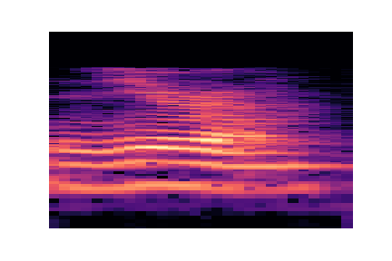

# Speech-Digit-Recognizer
In this project I attempt to train a model to recognize the number being said. I has a training set of 150 samples of each number from 
0 to 9 in .wav format. Then the librosa library was used to transform each of these .wav files into spectrograms. Finally, I used fast.ai and a pretrained
Resnet34 model to classify the spectrograms into their corresponding labels. Using this method achieves a 99% accuracy on the validation set.

*Spectrogram of 0*
